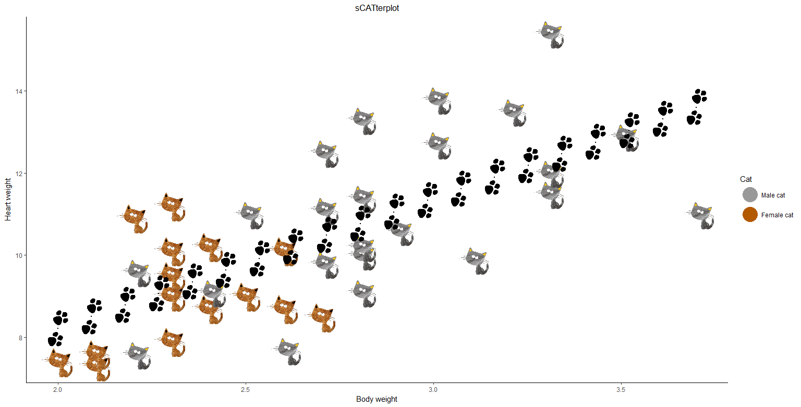

```{r setup, include=FALSE}
knitr::opts_chunk$set(echo = TRUE, eval = FALSE)
```

It will come as no surprise that cats and ggplot are among our favourite things here at mango. And there is an easy way to combine both:



Using the function `annotation_custom` of the popular ggplot2 package it is possible to display images on a plot as points of a scatterplot. This way data can be displayed in a more fun, creative way.  
In keeping with the cat theme I have chosen a data set about cats and a cat icon based on Mango the cat. The `MASS` package provides a data set called cats which contains the body weight, heart weight and sex of adult cats.


However since the data has 144 observations only a subset is used for the plot.

```{r}
library(MASS)
data(cats)
head(cats)
set.seed(1234)
cats <- cats[sample(1:144, size = 40),]
```

First a normal scatterplot is defined on which the images will be plotted later: 

```{r}
library(ggplot2)
sCATter <-ggplot(data = cats, aes(x = Bwt, y = Hwt)) +
  geom_point(size = 0, aes(group = Sex, colour = Sex)) +
  theme_classic() +
  xlab("Body weight") +
  ylab("Heart weight") +
  ggtitle("sCATterplot") +
  theme(plot.title = element_text(hjust = 0.5)) +
  # create a legend
  scale_color_manual(
    values = c("#999999", "#b35900" ),
    name = "Cat",
    labels = c("Male cat", "Female cat")
  ) +
  guides(colour = guide_legend(override.aes = list(size = 10)))
```

Any png image can be used for the plot, however images with a transparent background are preferable.  

```{r}
library(png)
library(grid)
mCat <- readPNG("MaleCat.png")
feCat<- readPNG("FemaleCat.png")
```

In the last step the cats are iteratively plotted onto the plot using `annotation_custom`.

```{r}
for (i in 1:nrow(cats)) {
  # distinguishing the sex of the cat
  if (cats$Sex[i] == "F") {
  image <- feCat
  } else{
  image <- mCat
  }
  sCATter = sCATter +
  annotation_custom(
    rasterGrob(image),
    xmin = cats$Bwt[i] - 0.6,
    xmax = cats$Bwt[i] + 0.6,
    ymin = cats$Hwt[i] - 0.6,
    ymax = cats$Hwt[i] + 0.6
  )
}
```


The cat´s paw trail is displaying a linear regression of heart on body weight. This can easily be added by computing a linear Regression, defining a grid to calculate the expected values and plotting cats on top of this data.

```{r}
LmCat <- lm(Hwt~Bwt, data = cats)

steps <- 20
Reg <- data.frame(Bwt = 
                    seq(from = min(cats$Bwt), 
                            to = max(cats$Bwt), 
                            length.out = steps))
Reg$Hwt <- predict(LmCat, newdata = Reg)
```

```{r}
sCATter <- sCATter + 
  geom_point(data = Reg, aes(Bwt, Hwt), size = 0)

paw <- readPNG("paw.png")
for (i in 1:nrow(Reg)) {
  sCATter = sCATter +
  annotation_custom(
    rasterGrob(paw),
    xmin = Reg$Bwt[i] - 0.6,
    xmax = Reg$Bwt[i] + 0.6,
    ymin = Reg$Hwt[i] - 0.6,
    ymax = Reg$Hwt[i] + 0.6
  )
}
sCATter
```